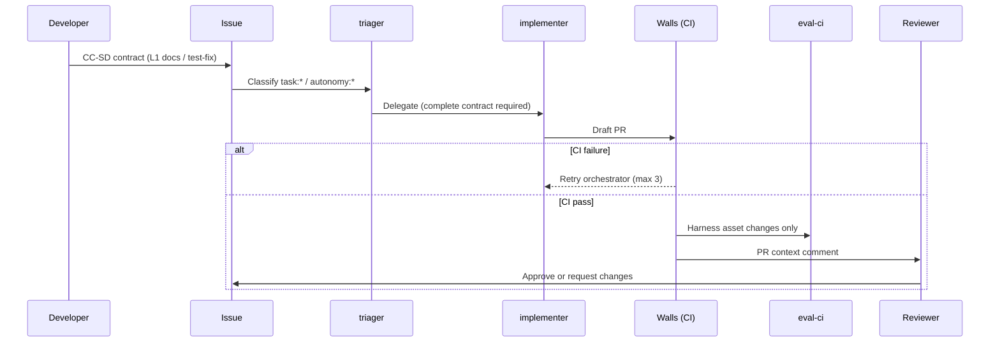
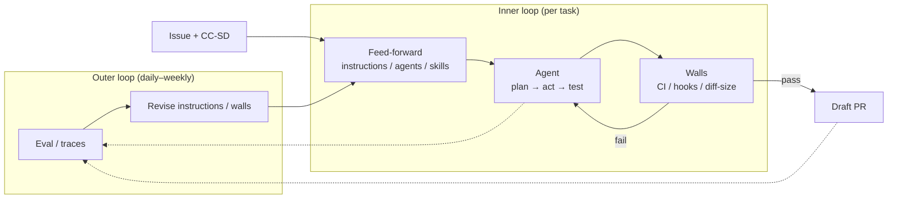
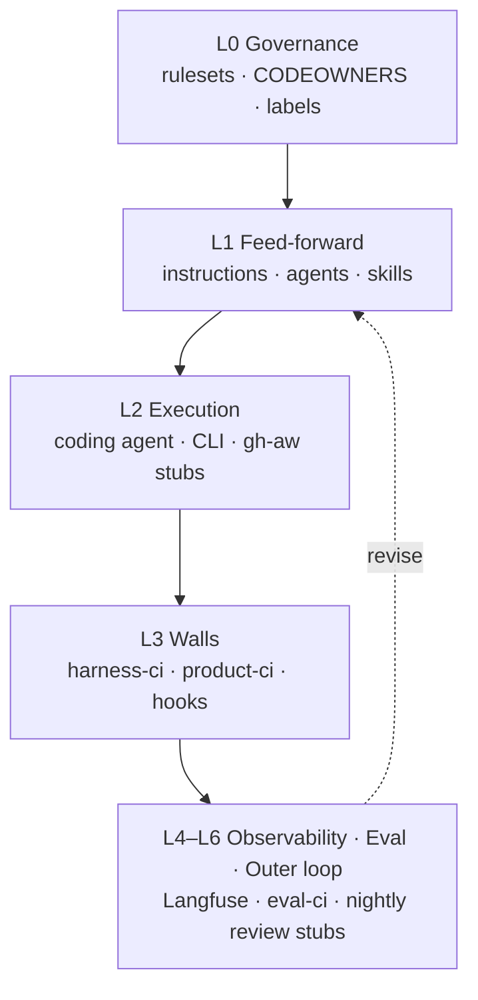

# SDLC-GH

**An agent harness template for GitHub Copilot — deterministic guardrails for AI coding agents.**

sdlc-gh is a template repository that keeps AI coding agents on track with **CI walls, hooks, evals, and operational policy** instead of prompt discipline alone. It is organization-agnostic and stack-agnostic (TypeScript / Python / Go / Ruby / PHP): copy it into any product repository and adapt it.

> The CI and documentation parts work standalone, but coding agent and gh-aw integration require GitHub Copilot (Business / Enterprise).

## Why

Teams adopting Copilot coding agent quickly run into the same problems:

- Agents open oversized PRs
- Destructive operations aren't reliably blocked
- Changing instructions has untracked effects on quality
- Approval points multiply until review becomes rubber-stamping

sdlc-gh addresses these with three design rules:

1. **Walls are deterministic** — tests, lint, diff-size limits, and hooks stop bad changes mechanically
2. **One human gate: PR review** — decision inputs (scores, cost, traces) are collected on the PR
3. **No harness change without an eval** — changes to instructions / agents / skills are verified in CI

The full architecture and rationale live in [docs/arch.md](docs/arch.md).

## Quick start

Requirements: a GitHub repository with Actions enabled; Node.js 22+ for the supported local setup flow and CI parity.

**Option A — new repository from template (easiest)**

Click **Use this template** on GitHub, delete the `sample/` stacks you don't need, and add your code.

**Option B — add the harness to an existing repository**

```bash
git clone https://github.com/YOUR_ORG/sdlc-gh.git /tmp/sdlc-gh

/tmp/sdlc-gh/scripts/bootstrap-harness.sh \
  --repo /path/to/your-product \
  --codeowners-team @your-org/harness-engineers

cd /path/to/your-product
./scripts/setup-github.sh --github-repo YOUR_ORG/your-product
./scripts/doctor.mjs --strict
git add -A && git commit -m "Add agent harness from sdlc-gh"
```

**Option C — start a brand-new product**

```bash
/tmp/sdlc-gh/scripts/bootstrap-harness.sh \
  --repo /path/to/new-product \
  --stack ts \
  --mode new \
  --codeowners-team @your-org/harness-engineers

cd /path/to/new-product
./scripts/setup-github.sh --github-repo YOUR_ORG/new-product
./scripts/doctor.mjs --strict
```

`--mode new` expands the minimal `sample/{stack}/` project into the repository root.

### After installing (required)

The harness is active only after GitHub setup and a clean doctor run:

1. **Bootstrap** — run `./scripts/bootstrap-harness.sh` and confirm the detected stack/mode summary
2. **Configure GitHub** — run `./scripts/setup-github.sh` to sync labels and create/update the `main-protection` ruleset with your stack's `product-ci-*` check. Optionally add `--with-eval-ruleset` after eval CI is stable.
3. **Verify** — run `./scripts/doctor.mjs --strict` until every required item passes

Manual fallback remains available for restricted environments:

- Apply labels from [.github/labels.yml](.github/labels.yml)
- Import [.github/ruleset.example.json](.github/ruleset.example.json) under *Settings → Rules*
- Ensure required checks include `harness-static`, `diff-size`, `issue-spec-check`, and your stack's `product-ci-*`

Detailed steps and rollback guidance: [docs/adoption.md](docs/adoption.md).

## Repository layout

```text
sdlc-gh/
├── AGENTS.md                # project instructions for agents (task classes, roles)
├── config/
│   └── stacks.json          # stack catalog (profile, marker, workflow mapping)
├── .github/
│   ├── copilot-instructions.md  # global agent policy
│   ├── instructions/        # per-path and per-stack conventions
│   ├── agents/              # triager / implementer / reviewer (least privilege)
│   ├── skills/              # verification procedure skill (quality-loop)
│   ├── hooks/               # destructive-command blocklist
│   ├── workflows/           # walls (harness-ci, product-ci-*), evals, retry, sync
│   ├── labels.yml           # task:* / autonomy:* label definitions
│   └── ruleset.example.json # branch protection example
├── docs/                    # architecture and operations docs (see below)
├── evals/                   # convention tests, rubric, e2e bench definitions
├── prompts/                 # prompts for gh models eval
├── scripts/                 # CI gate implementations, bootstrap, drift report
├── sample/                  # minimal ts / python / go / ruby / php samples (product CI targets)
└── infra/                   # optional Langfuse / OTel scaffolding
```

Inside this template, sample code lives under `sample/{stack}/` and all product CI workflows run when the corresponding marker file exists. In a bootstrapped product repository, only your selected stack's product CI workflow is copied and it targets the repository root.

## How a task flows



For `task:docs` and `task:test-fix` at `autonomy:L1`, the Issue embeds a lightweight CC-SD contract (`Goal`, `Non-goals`, `Constraints`, `Acceptance criteria`, `Rollback hints`). v1 does not cover `feature-small` or higher-risk classes. Details: [docs/coding-agent-l1.md](docs/coding-agent-l1.md).

On CI failure, `agent-retry-orchestrator` applies retry labels (max 3 attempts; stops after the same failure signature twice; security failures escalate immediately). Canonical thresholds live in [docs/operations.md](docs/operations.md).

## Local checks

Run from the repository root:

```bash
npm run validate          # harness asset consistency
npm run test-hooks        # hook block/allow scenarios
npm run test-issue-spec   # CC-SD issue-spec validator scenarios
npm run test-diff-size    # diff-size / autonomy gate scenarios
npm run test-e2e-manifest # e2e manifest structural checks
npm run test-setup-github # ruleset payload builder scenarios
npm run test-doctor       # doctor local check scenarios
npm run check-e2e         # e2e bench manifest checks
npm run run-e2e           # e2e bench executable acceptance checks
npm run verify-bootstrap  # bootstrap integration test (all stacks)
npm run check             # full local gate (validate + scenarios + e2e)
```

On Node.js versions older than 22, `run-e2e-bench.mjs` may skip verifiers that require the same runtime as CI and report them as skipped rather than failed.

Convention tests in Python:

```bash
pip install pytest
pytest evals/trajectories -q
```

## Phased rollout

Don't enable everything at once. Canonical phase definitions (including Phase 0 baseline) are in [docs/arch.md](docs/arch.md) §7. This table is the quick path; details in [docs/adoption.md](docs/adoption.md).

| Phase | Enable | Risk |
|-------|--------|------|
| 0 | CI walls, rulesets (`setup-github.sh`), optional Langfuse scaffold | Low |
| 1 | instructions, agents, hooks, templates | Low |
| 2 | `harness-ci` + your stack's `product-ci` | Medium |
| 3 | `eval-ci` + optional eval ruleset | Medium |
| 4 | coding agent L1 (`task:docs` / `task:test-fix` only) | Low–Medium |

Getting started with L1 delegation: [docs/coding-agent-l1.md](docs/coding-agent-l1.md).

## Project status

Functional today: bootstrap, harness/product CI, diff-size and autonomy gates, hooks scenarios, retry orchestrator, PR context comments, executable acceptance-style E2E checks (9 tasks), and eval scaffolding.

Known placeholders (aligned with [docs/arch.md](docs/arch.md) implementation status):

| Area | Status |
|------|--------|
| Bootstrap, stack catalog, harness/product CI | **Implemented** |
| Hooks, diff-size gate, CC-SD issue-spec check | **Implemented** |
| Custom agents (triager / implementer / reviewer) | **Implemented** |
| Eval CI with change-type job selection | **Implemented** |
| Retry orchestrator, PR context comments | **Implemented** |
| E2E bench (executable acceptance checks) | **Partial** — 9 tasks; not yet break-and-fix agent runner |
| `gh models eval` in CI | **Scaffolded** — runs when prompts exist; org must enable Models |
| gh-aw outer loop (`nightly-harness-review`, `weekly-redteam`) | **Stub** — Markdown + lock.yml placeholders; **does not compile** with `gh aw compile`; compileability not guaranteed; deferred to a separate epic due to Public Preview dependency |
| Langfuse / OTel export | **Scaffolded** — `infra/` + schema; wiring optional |

### Observability placeholders (spec only)

Until Langfuse / OTel is wired, PR context comments use fixed placeholders (workflow logic unchanged):

| Field | When unset / n/a |
|-------|------------------|
| Trace link | `_configure LANGFUSE_HOST; then search by repo=…, pr_number=…_` |
| AI credits | Informational — `_set max-ai-credits in org settings_` |
| Threat detection | `n/a` — gh-aw outer loop remains stub |

Validate sample payloads: `node scripts/validate-telemetry.mjs "$(cat infra/samples/telemetry-payload.json)"`. See [docs/telemetry-schema.md](docs/telemetry-schema.md).

## Architecture

The harness is a **dual-loop control system**: a fast inner loop (agent + deterministic walls) and a slower outer loop (eval + harness revision).



Layers as implemented in this repo (details in [docs/arch.md](docs/arch.md)):



## Documentation

| Document | Contents |
|----------|----------|
| [docs/arch.md](docs/arch.md) | Full architecture and design principles |
| [docs/adoption.md](docs/adoption.md) | Installation and rollback |
| [docs/operations.md](docs/operations.md) | Thresholds, retry policy, forbidden ops (**canonical** policy) |
| [docs/revert-playbook.md](docs/revert-playbook.md) | Revert procedure (harness vs product) |
| [docs/coding-agent-l1.md](docs/coding-agent-l1.md) | Running the first L1 delegations |
| [docs/failure-taxonomy.md](docs/failure-taxonomy.md) | Classifying failures for outer-loop routing |
| [docs/kpi-baseline.md](docs/kpi-baseline.md) | Weekly KPI tracking template |
| [docs/telemetry-schema.md](docs/telemetry-schema.md) | Required observability fields |
| [docs/auth-boundaries.md](docs/auth-boundaries.md) | Credential boundaries per execution mode |
| [docs/shared-config.md](docs/shared-config.md) | Distributing shared assets across repositories |
| [docs/exceptions/README.md](docs/exceptions/README.md) | Recording policy exceptions |
| [infra/README.md](infra/README.md) | Self-hosting Langfuse / OTel |
| [CONTRIBUTING.md](CONTRIBUTING.md) | Contribution workflow and review expectations |
| [SECURITY.md](SECURITY.md) | Vulnerability reporting policy |
| [CODE_OF_CONDUCT.md](CODE_OF_CONDUCT.md) | Community behavior expectations |
| [SUPPORT.md](SUPPORT.md) | Support routes and troubleshooting intake |

## FAQ

**Q. How do I pull template updates into a repository that already uses the harness?**
A. Re-run `bootstrap-harness.sh` to overwrite harness assets, then review the diff with `npm run drift-report`. The `harness-sync` workflow produces a weekly drift report.

**Q. Does the harness itself need a test framework (Jest etc.)?**
A. No. The harness is guarded by the `scripts/*.mjs` checks and `eval-ci`. Your application keeps its own test runner (vitest / pytest / go test / rspec / phpunit).

## Project policies

- Contribution guide: [CONTRIBUTING.md](CONTRIBUTING.md)
- Security reporting: [SECURITY.md](SECURITY.md)
- Code of conduct: [CODE_OF_CONDUCT.md](CODE_OF_CONDUCT.md)
- Support: [SUPPORT.md](SUPPORT.md)

## License

[MIT](LICENSE)
