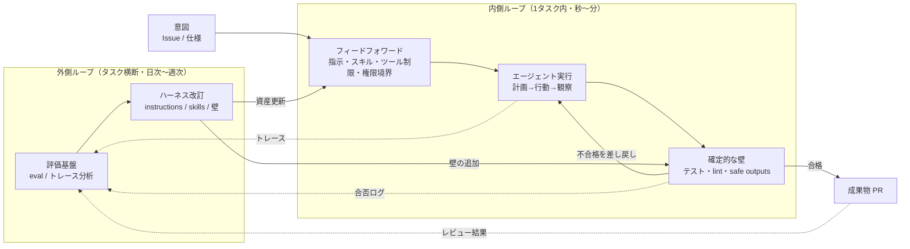
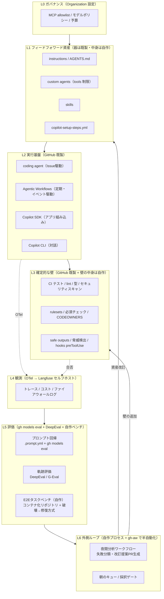
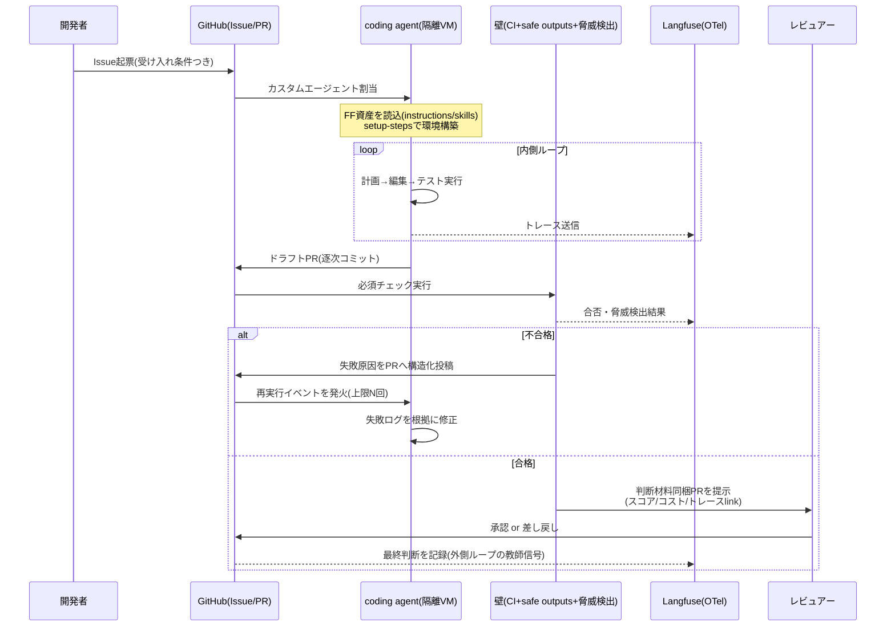

# GitHub Copilot を核としたエージェントハーネス — 全体アーキテクチャ設計書

**版**: 1.0（2026-07-04）
**前提とする定義**: ハーネスとは「AIを意図通りに従わせる包括的な仕組み」であり、フィードフォワード（実行前に意図を注入する側）とフィードバック（実行結果を観測して修正する側）の二系統で構成される。プロンプトやコンテキストはその一部にすぎない。

---

## 1. エグゼクティブサマリ

本書は、GitHub Copilot エコシステム（coding agent / CLI / SDK / Agentic Workflows / GitHub Models）と OSS（Langfuse、DeepEval、promptfoo 等）を組み合わせて構築する、エージェントハーネスの全体アーキテクチャを示す。

設計の結論は次の三行に要約できる。

1. **強制力のある機構はすべて既製で賄う。** 隔離実行、safe outputs、確定的な壁、観測、評価実行エンジンは GitHub 基盤と OSS で構築し、自作しない。
2. **自作投資は「意図の定義」に集中させる。** ゴールデンデータセット、判定基準（rubric）、検証の壁の中身、改訂サイクルの運用——制御系で言う目標値と評価関数——が唯一の差別化領域であり、工数の過半をここに配分する。
3. **UX は「人間の判断点を PR レビューただ一点に収束させる」ことを最優先とする。** エージェントの自律度がどれだけ上がっても、人間が守る関門を増やさず、関門の質を上げる方向に設計する。

---

## 2. 設計原則

### 2.1 制御系としてのハーネス

ハーネスを二重ループの制御系としてモデル化する。



原則として、**内側ループは秒〜分で高速に回り、外側ループは日次〜週次で回る**。外側ループが存在しないハーネスは開ループ制御に近く、モデル更新やタスク分布の変化（外乱）に対して劣化していく。

### 2.2 五つの設計原則

**原則1: 壁は宣言的・決定論的であること。** エージェントの善意やプロンプトの巧拙に依存する制約は制約ではない。gh-aw の safe outputs が示す通り、「1回の実行で PR は最大3件」のような制約はエージェント自身に上書き不能な形で宣言する。プロンプトに「〜しないでください」と書くのは最後の手段。

**原則2: シークレットとエージェントを構造的に分離する。** ただしこれは全実行モードで一様に成立する前提ではない。gh-aw のシークレットレス設計（エージェントは認証情報に一切触れず、プロキシとゲートウェイが代理認証する）を理想形としつつ、CLI / SDK / coding agent では「短命資格情報」「代理実行サービス」「書き込み先限定のトークン」のいずれかに閉じ込める。恒久鍵をエージェントのプロンプト空間に露出させないことを不変条件とし、ポリシーではなくアーキテクチャで守る。

**原則3: すべての信頼境界にログを置く。** 観測できる場所は将来制御できる場所である。トレースは OpenTelemetry 準拠で出力し、特定ベンダーにロックインしない。

**原則4: 評価なき変更を禁止する。** instructions、skills、モデル選択、ツール構成——ハーネス資産のあらゆる変更は、変更前後で eval を通し、スコアの差分を PR に添付する。ハーネス自体を「テストのあるコード」として扱う。

**原則5: 人間の関門は一つに絞り、そこを強くする。** 承認ポイントを散在させると、人間は「承認疲れ」からすべてを素通しするようになる。関門を PR レビュー一点に集約し、そこに判断材料（評価スコア、脅威検出結果、コスト、トレースへのリンク）をすべて集める。

補足すると、この原則は L0〜L1 の通常タスクに対する既定値である。L2 の auto-merge 候補は「事前に定義した昇格条件を満たした領域に限る非同期承認」とみなし、L3 はドキュメント修正など事故半径を極小化できる領域だけに限定する。つまり PR レビューを廃止するのではなく、レビューの同期性と適用範囲を厳密に制御する。

---

## 3. 現状分析（2026年半ば時点）

### 3.1 GitHub 基盤の成熟度マップ

| 層 | 提供物 | 成熟度 | 備考 |
|---|---|---|---|
| 指示の階層 | copilot-instructions.md / AGENTS.md / .instructions.md（パス指定） | ◎ GA | 優先度: カスタムエージェント > パス指定 > 全体 |
| カスタムエージェント | .github/agents/*.agent.md（tools 制限・handoffs・組織配布） | ○ GA（一部IDEはプレビュー） | 組織レベルは .github-private で配布 |
| スキル | Agent Skills（オープン仕様、Claude Code / Codex と互換） | ○ | オンデマンドロードでトークン節約 |
| フック | hooks.json（preToolUse 等 6 イベント） | ○ | 破壊的操作の決定論的ブロックが可能 |
| 環境準備 | copilot-setup-steps.yml | ○ | 失敗してもエージェントは続行する点に注意 |
| 隔離実行 | coding agent（Actions VM、自ブランチのみ push、依頼者は自PRを承認不可） | ◎ GA | |
| 自動化実行 | Agentic Workflows（gh-aw）: Markdown→lock.yml コンパイル、AWF ファイアウォール、safe outputs、脅威検出、入力サニタイズ、シークレットレス | △ Public Preview | 設計思想は最先端だが本番投入は段階的に |
| 観測 | gh aw logs / audit、max-ai-credits、OTel エクスポート、ファイアウォールログ | ○ | |
| 評価 | GitHub Models: .prompt.yml + gh models eval（CI 統合、JSON 出力、LLM-as-judge） | ○ | ただし単発プロンプト評価。エージェント軌跡評価は不可 |
| 組み込み | Copilot SDK（Node/Python/Go/.NET/Java、MITライセンス、JSON-RPC で CLI と通信） | △ Public Preview | |

### 3.2 OSS の補完マップ

| 目的 | 第一候補 | 代替 | 選定理由 |
|---|---|---|---|
| トレース・観測 | Langfuse（セルフホスト） | Phoenix / OpenLLMetry / Opik | OSS 観測のデファクト。OTel 互換で乗り換え可能 |
| 評価（軌跡・エージェント単位） | DeepEval | promptfoo（CLI ファースト）/ Ragas（RAG） | pytest 的に CI へ組み込める。G-Eval / タスク完遂メトリクス |
| 脆弱性・レッドチーム | NVIDIA garak | AI-Infra-Guard | プロンプトインジェクション耐性の定期試験 |
| ワークフロー静的検査 | zizmor / actionlint / poutine | — | gh aw compile に統合可能 |
| E2E タスクベンチの雛形 | SWE-bench 系ツール群 | EvalView 等 | 「テストを落とした状態から直せるか」方式の参考実装 |
| テンプレート資産 | github/awesome-copilot | — | instructions / agents / skills / hooks / workflows の公式レシピ集 |

### 3.3 ギャップ分析 — 自作が必須の領域

ギャップは三つに収束している。

**G1: エージェント軌跡レベルのゴールデンデータセット。** gh models eval は単発プロンプト評価であり、「Issue を渡したらテストの通る PR が出るか」という E2E 評価はできない。GitHub 自身は内部で、CI を通過済みの約100のコンテナ化リポジトリを意図的にテスト失敗状態に改変し、モデルが修復できるかを見る方式を運用しているが、これはプロダクトとして提供されていない。自リポジトリ版を自作する必要がある。

**G2: 判定基準（rubric）。** LLM-as-judge の器は GitHub Models にも DeepEval にもあるが、「良い」の定義そのものはドメイン知識であり外注不能。

**G3: 改訂サイクルの運用。** トレース → 失敗パターン抽出 → データセット追加 → フィードフォワード改訂 or 壁の追加、という振り分け判断のプロセス。gh-aw で半自動化（改訂案を PR として毎朝提出）はできるが、採用判断のゲートと基準は自作。

---

## 4. UX 設計

アーキテクチャの前に UX を定義する。ハーネスの失敗の大半は技術ではなく、人間側の「承認疲れ」「不信による不使用」「過信による素通し」で起きるためである。

### 4.0 適用範囲と対象外

本設計は、コード・テスト・設定・ドキュメントの変更を主対象とする。ただし、事故半径が大きい操作は初期状態で対象外とし、明示的に昇格審査を通るまで自動化しない。

| 区分 | 既定値 | 例 |
|---|---|---|
| 対象 | L0〜L2 の候補 | アプリ実装、テスト追加、リファクタ、依存更新、ドキュメント修正 |
| 初期対象外 | 常に人間承認必須 | 本番 DB 直接操作、本番環境シークレット変更、課金/権限/法務文言変更、個人情報を含むデータ処理 |
| 領域限定でのみ L3 許可 | 条件付き | typo 修正、リンク修正、コメント整形、非実行ドキュメント更新 |

対象外を先に明記する理由は、運用中に「便利だから」で境界が溶けるのを防ぐためである。

### 4.1 ペルソナと責務

| ペルソナ | 責務 | 主な接点 |
|---|---|---|
| **開発者**（タスク委任者） | Issue を書き、エージェントに委任し、PR をレビューする | Issue / PR / IDE / CLI |
| **レビュアー** | 成果物の最終関門。判断材料が揃った PR を審査する | PR |
| **ハーネスエンジニア**（新設ロール） | ハーネス資産（instructions / skills / 壁 / eval）の保守。外側ループの運転者 | ハーネスリポジトリ / ダッシュボード / 朝のキュー |
| **組織管理者** | MCP allowlist、モデルポリシー、予算、監査 | Organization 設定 / 監査ログ |

ポイントは**ハーネスエンジニアを明示的なロールとして置く**こと。全員が片手間に触る資産は劣化する。小規模チームでは兼任でよいが、責務としては分離する。

### 4.2 UX 原則

**単一関門の原則。** 人間の判断点は「PR レビュー」一点。エージェントへの中間承認（このコマンド実行していい？）は、hooks と safe outputs による決定論的な自動判定に置き換え、人間には求めない。判断を求められる回数が減るほど、一回あたりの判断の質は上がる。

**判断材料の同梱原則。** レビュアーが PR 画面から離れずに判断できるよう、PR 本文に次を自動添付する: 評価スコア（該当する eval があれば）、脅威検出の結果、消費 AI クレジット、トレースへの deep link、エージェントが従った instructions/skills のバージョン。

**朝のキュー原則。** 外側ループの成果物（夜間ワークフローが生成した改訂提案、失敗分析レポート、ドリフト警告）は、リアルタイム通知ではなく「毎朝のキュー」として一括提示する。gh-aw の設計思想（朝起きたらレビュー可能な改善が届いている）に合わせ、割り込みではなくバッチでレビューする体験にする。

**自律度の段階制御。** エージェントへの信頼は一律ではなくタスク種別ごとに段階を設定し、実績（eval スコアと採択率）に応じて昇格させる。

| レベル | 動作 | 昇格条件（例） |
|---|---|---|
| L0 提案のみ | ドラフト PR も作らず、コメントで提案 | 初期状態 |
| L1 ドラフト PR | 変更を PR にするが CI のみ、人間レビュー必須 | eval 合格率 > 70% |
| L2 自動マージ候補 | 壁全通過で auto-merge キューへ（人間は非同期確認） | 直近50件の採択率 > 90% かつ重大差し戻しゼロ |
| L3 完全自動 | ドキュメント修正など限定領域のみ、壁全通過で即マージ | 領域限定 + 90日間無事故 |

**失敗の可視化原則。** エージェントの失敗を隠さない。差し戻された PR、脅威検出でブロックされた出力、予算超過で停止した実行は、すべて週次レポートに集計して見せる。失敗が見えないハーネスは信頼されないか、過信される。

**認証境界の明示原則。** 実行モードごとに資格情報の扱いを明記する。gh-aw は原則シークレットレス、coding agent はブランチ/リポジトリ/環境を絞った短命トークン、CLI/IDE はローカル開発者権限の委譲範囲を監査ログつきで利用、SDK 組み込みは代理実行サービス越しに限定操作のみ許可、というように、モード別の境界を最初から設計書に刻む。

**変更サイズ制限の原則。** 自律度は変更の正しさだけでなく変更の大きさにも従属する。高自律レベルほど、変更行数、変更ファイル数、責務数を厳しく制限する。大きな変更は分割できること自体が品質指標である。

### 4.3 主要ジャーニー

**J1: 開発者がタスクを委任する**
Issue 起票（テンプレートが受け入れ条件の記述を強制）→ カスタムエージェントを割り当て → エージェントが Actions 上で作業、ドラフト PR に進捗をコミット → 壁（CI + safe outputs + 脅威検出）通過 → 判断材料同梱の PR がレビュアーに届く → マージ。開発者の操作は「Issue を書く」と「PR を見る」の二つだけ。

**J2: ハーネスエンジニアが外側ループを回す**
毎朝、夜間ワークフローが生成したキューを開く: (a) 昨日の失敗トレースの分類レポート、(b) instructions/skills の改訂提案 PR（eval 差分スコア付き）、(c) eval 回帰の警告。エンジニアは改訂 PR を採択/棄却し、新たな失敗パターンをデータセットに追加する Issue を切る。所要 30 分/日を目標とする。

**J3: 組織管理者がガバナンスを効かせる**
MCP allowlist、利用可能モデル、リポジトリごとの予算（max-ai-credits）を Organization 設定で宣言。監査はファイアウォールログと gh aw audit で行い、個別チャットは見ない（プライバシーと信頼の維持）。

### 4.4 タスク分類と自律度マトリクス

自律度は一律に上げず、タスク分類ごとに上限を持たせる。

| タスク分類 | 例 | 許可ツール/操作 | 既定の最大自律度 | 追加制約 |
|---|---|---|---|---|
| `docs` | README、設計書、コメント修正 | read/edit/test | L3 | 実行コード非変更、差分 120 LOC 以内 |
| `test-fix` | 壊れたテスト修正、欠落テスト追加 | read/edit/test | L2 | 本番コード変更は単一責務のみ |
| `refactor` | 命名整理、重複除去 | read/edit/test | L1 | 振る舞い不変をテストで証明 |
| `feature-small` | 小機能追加 | read/edit/test | L1 | 差分 300 LOC、変更ファイル 8 以内 |
| `dependency-bump` | patch/minor 更新 | read/edit/test/package manager | L1 | lockfile 差分と回帰テスト必須 |
| `infra` | CI、IaC、権限、デプロイ | read/edit/test limited deploy metadata | L0 | 人間が同期レビュー |
| `security-sensitive` | 認可、課金、秘密情報、監査 | read only or proposal only | L0 | 実装は人間主導 |

この表は固定値ではなく、四半期ごとに採択率・事故率・差し戻し率で見直す。

---

## 5. アーキテクチャ全体像

### 5.1 レイヤー構成



### 5.2 コンポーネント詳細と調達区分

| # | コンポーネント | 調達 | 実装 |
|---|---|---|---|
| C1 | 指示階層 | 器=GitHub / 中身=自作 | `.github/copilot-instructions.md`（全体規約）、`.github/instructions/*.instructions.md`（パス別）、`AGENTS.md`。awesome-copilot を雛形に |
| C2 | カスタムエージェント群 | 器=GitHub / 中身=自作 | `implementer`（実装。tools を read/edit/test 実行に限定）、`reviewer`（レビュー専用。edit 権限なし）、`triager`（Issue 分類。read のみ）など役割ごとに最小権限で定義。handoffs で計画→実装を接続 |
| C3 | スキル | 仕様=オープン / 中身=自作 | ドメイン手順・社内規約を skills 化。検証ループ（基準を満たすまでリトライ）をスキル内に記述 |
| C4 | 決定論的ガード | 器=GitHub / ルール=自作 | hooks.json の preToolUse で破壊的コマンドをブロック。safe outputs で出力の種類・件数・形式を宣言的に制限 |
| C5 | 実行モード | GitHub | 対話=CLI/IDE、Issue駆動=coding agent、定期/イベント駆動=gh-aw、アプリ組込=Copilot SDK。四つで全ユースケースを被覆 |
| C6 | 隔離・認証・ネットワーク | GitHub + 自作ポリシー | gh-aw は AWF ファイアウォール（ドメイン allowlist）、シークレットレス構成、入力サニタイズ。coding agent は短命かつスコープ限定の資格情報のみ許可。CLI/IDE と SDK は代理実行サービスまたはローカル権限委譲の監査ログを必須化し、恒久鍵の直接露出を禁止 |
| C7 | 壁（中身） | 自作 | テストスイート、lint、型、契約テスト、ビジネスルール検証。**ハーネス投資の最重要領域。** エージェント導入はテスト整備投資の回収期でもある |
| C8 | 観測 | OSS | gh-aw の OTel エクスポート → Langfuse（セルフホスト）。SDK 経由の実行も OTel で同一基盤に集約。ダッシュボード: コスト、失敗率、差し戻し率、ドリフト |
| C9 | プロンプト回帰 | GitHub | `.prompt.yml` をリポジトリ管理し、gh models eval を CI の必須チェックに。ハーネス資産の PR はこれを通らないとマージ不可（原則4） |
| C10 | 軌跡評価 | OSS | DeepEval をテストとして記述（タスク完遂、ツール選択妥当性、規約遵守を G-Eval で採点）。判定基準 rubric は自作 |
| C11 | E2E タスクベンチ | **自作** | 自リポジトリの過去 Issue/PR から 20〜100 件のタスクを抽出し、コンテナ化。「テストを落とした状態から修復できるか」を pass@1 で計測。SWE-bench 系を雛形に |
| C12 | 外側ループ | gh-aw + 自作プロセス | 夜間 gh-aw ワークフロー: トレースと差し戻し PR を分析 → 失敗を「FF 不足 / 壁不足 / モデル限界」に分類 → instructions/skills 改訂案を eval 差分付き PR で提出。採択判断は人間（J2） |

### 5.2.1 変更種別ごとの必須評価マトリクス

| 変更種別 | 最低限必須の評価 | マージ条件 |
|---|---|---|
| `copilot-instructions.md` / `AGENTS.md` / `instructions/*.instructions.md` | `gh models eval` + DeepEval の規約遵守ケース | ベースライン比で劣化なし |
| `agents/*.agent.md` | `gh models eval` + DeepEval のツール選択妥当性 + 権限制約の静的検査 | 禁止ツール到達なし、スコア劣化なし |
| `skills/**` | DeepEval のタスク完遂 + 規約遵守 | 対象タスク群で pass rate 劣化なし |
| `hooks/hooks.json` / safe outputs / rulesets | 静的検査 + 回帰用の拒否/許可シナリオテスト | 危険操作の誤許可ゼロ |
| モデル選択・温度・予算などの実行設定 | `gh models eval` + E2E ベンチの代表サンプル | 品質閾値を満たし、コスト上振れが予算内 |
| eval / rubric / E2E ベンチ自体 | メタレビュー + サンプル再現性確認 | 判定ぶれ許容範囲内、再現可能 |

原則4を運用に落とすため、ハーネス資産の PR では「変更ファイルに応じて上表の評価を自動選択する」CI を組む。単一の eval で全変更を守ろうとしない。

### 5.2.2 自律度ごとの変更サイズ上限

| レベル | 差分行数上限 | 変更ファイル数上限 | 備考 |
|---|---|---|---|
| L0 | 制限なし | 制限なし | 提案のみ |
| L1 | 300 LOC | 8 files | 単一 Issue に閉じること |
| L2 | 120 LOC | 4 files | 単一責務、ロールバック容易性必須 |
| L3 | 60 LOC | 2 files | 非実行資産または事前承認済み限定領域のみ |

上限超過時は失敗ではなく分割候補として扱い、タスク分解を優先させる。

### 5.3 データフロー（1タスクのライフサイクル）



ここでいう「差し戻し(自動)」は概念ではなく具体的な制御として定義する。PR の必須チェックが失敗したら、CI は失敗分類（テスト失敗 / lint / 型 / safe outputs / セキュリティ）を構造化コメントとして残し、オーケストレータがそのイベントを受けて同一 PR 上で再実行する。再試行は上限 N 回までとし、超過時のみ人間へエスカレーションする。これにより、内側ループの再入責務は人間ではなくオーケストレータ側に置かれる。

失敗分類はさらに運用定義を持つ。規約違反や手順漏れの反復は `FF不足`、CI は通るがレビューで落ちるものは `壁不足`、必要情報・権限・ツールが揃っていても複数回失敗するものは `モデル限界` として扱う。分類ルールを固定することで、朝のキューでの振り分けぶれを抑える。

### 5.4 観測の最小スキーマ

トレース基盤には最低限、次の項目を構造化して残す。

| 項目 | 用途 |
|---|---|
| `task_id` / `pr_number` / `repo` | タスク単位の追跡 |
| `agent_type` / `execution_mode` / `model` | 実行条件の比較 |
| `task_class` / `autonomy_level` | 自律度分析 |
| `tool_calls` / `retry_count` / `wall_failure_type` | 失敗分析 |
| `cost` / `elapsed_time` | コストと待ち時間管理 |
| `changed_files` / `diff_loc` | 変更サイズ監視 |
| `final_outcome` / `review_outcome` | 採択率・差し戻し率集計 |

これがないと、モデル変更・指示変更・タスク難度変化を後から分離できない。

### 5.5 レビュアー判断基準

PR レビュー一点に判断を集約する代わりに、レビュアーが見る観点は固定する。

1. 要件適合: Issue の受け入れ条件を満たしているか。
2. 境界遵守: 対象外領域や禁止操作に踏み込んでいないか。
3. テスト妥当性: 追加・既存テストが変更内容を十分に拘束しているか。
4. 説明責任: PR 本文の評価結果、コスト、トレースリンクが判断に足るか。
5. ロールバック容易性: 問題発生時に即時 revert できるか。

### 5.6 リポジトリ構成（標準形）

```text
your-product-repo/
├── AGENTS.md                        # プロジェクト全体の指示（オープン仕様）
├── config/
│   └── stacks.json                  # stack カタログ（ts / python / go / ruby / php）
├── .github/
│   ├── copilot-instructions.md      # 全体規約
│   ├── instructions/                # パス指定規約（*.instructions.md）
│   ├── agents/                      # implementer / reviewer / triager .agent.md
│   ├── skills/                      # ドメイン手順（Agent Skills 仕様）
│   ├── hooks/hooks.json             # preToolUse ガード
│   └── workflows/
│       ├── harness-ci.yml           # ハーネス壁 + stack 検出 product CI
│       ├── product-ci-{stack}.yml   # bootstrap 時は選択 stack の1本のみ
│       ├── copilot-setup-steps.yml  # エージェント環境準備
│       ├── nightly-harness-review.md(+.lock.yml)  # gh-aw: 外側ループ
│       └── weekly-redteam.md(+.lock.yml)          # gh-aw: garak 定期試験
├── sample/                          # テンプレート repo のみ（各 stack 最小 sample）
├── prompts/                         # .prompt.yml（gh models eval 対象）
└── evals/
    ├── trajectories/                # DeepEval テスト + rubric
    └── e2e-bench/                   # 自作タスクベンチ（コンテナ定義+期待結果）
```

テンプレート repo（sdlc-gh）では `sample/{stack}/` を同居させ、marker 検出で複数 `product-ci-*` が走る。bootstrap 後の product repo では選択 stack の profile・`product-ci`・trim 済み `harness-ci` のみが展開される（`config/stacks.json` 参照）。

ハーネス資産をプロダクトと同一リポジトリに置くことで、Git 管理・PR レビュー・ロールバックがそのまま効く。組織横断の共通資産は `.github-private` リポジトリで配布する。

---

## 6. 段階導入ロードマップ

一度に全部入れない。各フェーズは「前フェーズの計測値」を昇格条件とする。

**Phase 0（〜2週間）: 壁と計測の土台。**
CI・lint・型チェックを必須チェック化し、rulesets を整備する。エージェント以前に、確定的な壁が緩いリポジトリにエージェントを入れても品質は上がらない。同時に Langfuse をセルフホストし、OTel の受け口を作る。

**Phase 1（〜1ヶ月）: フィードフォワード最小構成 + 対話利用。**
copilot-instructions.md と主要パスの instructions を整備（awesome-copilot を雛形に）。hooks で破壊的操作をブロック。あわせて CLI/IDE、coding agent、gh-aw、SDK それぞれの認証境界表を作る。開発者は CLI/IDE で対話利用を開始。この時点の差し戻し率・体感品質を記録し、以後のベースラインとする。

**Phase 2（〜2ヶ月）: 評価基盤と Issue 駆動委任。**
prompts/ と gh models eval を CI に組み込み、さらに DeepEval・静的検査・拒否/許可シナリオテストを変更種別マトリクスに従って自動選択する。「ハーネス資産の変更は eval 必須」の運用をここで発効させる。過去の Issue/PR から 20 件の E2E タスクベンチ初版を作成。coding agent への Issue 委任を L1（ドラフト PR）で開始。カスタムエージェントを implementer / reviewer の 2 種から始める。

**Phase 3（〜3ヶ月以降）: 外側ループの自動化と自律度昇格。**
gh-aw で夜間分析ワークフローを稼働（Public Preview であることを踏まえ、read-only + safe outputs 最小構成から）。同時に PR チェック失敗を契機に同一タスクを再実行するオーケストレーションを導入し、内側ループを自動閉ループ化する。朝のキュー運用を開始し、ハーネスエンジニアのロールを正式化。計測値が昇格条件を満たした領域から L2（auto-merge 候補）へ。garak による週次レッドチームを常設。

**Phase 4（安定運用期）: 例外運用とロールバックの標準化。**
例外承認フローを導入し、「誰が」「どの理由で」「何日間」原則を外せるかを記録する。あわせて L2/L3 領域は squash merge 前提、即時 revert 条件、revert 実行責務、事後レビュー期限を標準化する。自動化は投入だけでなく撤回まで設計して完成とみなす。

---

## 7. リスクと対策

| リスク | 対策 |
|---|---|
| gh-aw が Public Preview（仕様変更・不具合の可能性） | 外側ループと定期タスクに限定して採用し、本流の CI/CD は従来の Actions で維持。lock.yml をコミットしバージョン固定。billing 影響のあった版のような問題に備え、リリースノートの追跡を運用に組み込む |
| プロンプトインジェクション | gh-aw の入力サニタイズ + シークレットレス構成 + AWF allowlist を前提とし、さらに garak で定期的に自己攻撃。エージェントが読む外部入力（Issue 本文等）は常に不信の前提で扱う |
| 実行モードごとに認証境界が崩れる | モード別の資格情報マトリクスを維持し、恒久鍵の直接露出を禁止。短命トークン、代理実行サービス、監査ログを標準化し、例外は明示レビュー対象にする |
| 承認疲れ・素通し | 単一関門の原則（§4.2）。中間承認を hooks/safe outputs の自動判定へ置換。判断材料の同梱で 1 判断あたりの認知コストを下げる |
| コスト逸走 | max-ai-credits の実行単位ハードキャップ + Langfuse でリポジトリ/ワークフロー別コストを週次確認。従量課金（AI クレジット）移行後の予算アラートを組織設定で構成 |
| eval の過学習（ベンチだけ良くなる） | E2E ベンチのタスクを四半期ごとに 20% 入れ替え。本番の差し戻し率と eval スコアの乖離を監視し、乖離が開いたらベンチを疑う |
| 原則4 が運用で形骸化する | 変更種別ごとの必須評価マトリクスを CI にコード化し、必要評価の未実行をマージブロック条件にする |
| 自動再試行ループが暴走する | 再試行上限 N 回、同一失敗シグネチャでの即停止、コスト上限到達時の強制停止を設ける |
| 例外運用が常態化する | 例外は期限付き・記録必須・事後レビュー必須とし、期限切れ例外を自動検知する |
| 差分が大きすぎてレビュー不能になる | 自律度ごとの変更サイズ上限を壁に組み込み、超過時は分割を要求する |
| ベンダーロックイン | トレースは OTel 準拠、skills はオープン仕様、AGENTS.md は複数エージェント互換。エンジン切替可能な gh-aw の性質を保険とする |
| ハーネス資産の属人化 | 資産はすべて Git 管理 + PR レビュー + eval 差分必須。ハーネスエンジニアをロールとして明示し、ドキュメント化された朝のキュー運用に載せる |

---

## 8. 自作領域の明細（投資の集中先）

最終的に自作するのは以下だけであり、逆に言えばここが品質のすべてを決める。

1. **壁の中身**: テストスイート、契約テスト、ビジネスルール検証。エージェントの成果はここの網羅性を超えられない。
2. **E2E タスクベンチ（G1）**: 自リポジトリ由来の 20〜100 タスク。破壊→修復方式。pass@1 と差し戻し率を主要 KPI に。
3. **判定基準 rubric（G2）**: 「良い PR」「良いレビューコメント」の定義。DeepEval の G-Eval / GitHub Models の LLM-as-judge に与える採点仕様。
4. **改訂サイクルの運用（G3）**: 失敗の三分類（フィードフォワード不足 / 壁不足 / モデル限界）と、それぞれの改訂先への振り分け基準。朝のキュー 30 分/日の運用設計。
5. **フィードフォワードの中身**: instructions / agents / skills に書くドメイン知識・規約・境界。
6. **例外とロールバックの台帳**: 原則を外した記録、期限、revert 条件、事後レビュー結果。

## 9. KPI（ハーネスの健全性指標）

内側ループ: PR 差し戻し率、壁の初回通過率、タスクあたり AI クレジット、自動再試行の平均回数。
外側ループ: E2E ベンチ pass@1 の推移、改訂 PR の採択率、失敗分類の構成比の変化（「壁不足」比率が下がっていれば壁が育っている証拠）。
品質遅行指標: マージ後 7 日以内の revert 率、エージェント起因のホットフィックス率、レビュー後追加修正率。
UX: レビュアーの 1 PR あたり判断時間、朝のキュー処理時間、自律度レベルの分布。

運用ガード: 自動再試行の平均回数、再試行上限到達率、認証境界違反の検出件数。

## 10. 例外承認とロールバック

原則を守れないケースはなくせないため、例外を禁止するのではなく、例外の作法を固定する。

1. 例外は `理由`, `対象タスク`, `逸脱する原則`, `承認者`, `有効期限` を必須項目として記録する。
2. 例外の有効期限は最長 14 日とし、延長は新規申請として扱う。
3. L2/L3 でマージされた変更は即時 revert 手順を PR 本文に持つ。
4. 例外を使った変更は、次の朝のキューで事後レビュー対象に自動追加する。
5. 同一理由の例外が反復する場合は運用逸脱ではなく設計不足とみなし、ハーネス改訂 Issue を起票する。

---

## 付録: 本設計の前提となる事実（2026-07 時点）

- Agentic Workflows は Public Preview。デフォルト読み取り専用、safe outputs、脅威検出、AWF ファイアウォール、シークレットレス構成を備える。
- Copilot SDK は Public Preview（MIT ライセンス、Node/Python/Go/.NET/Java、JSON-RPC で CLI サーバーと通信）。
- GitHub Models の gh models eval は .prompt.yml を CI で評価可能（string match / similarity / LLM-as-judge、JSON 出力）。
- GitHub Copilot の課金は 2026-06 からプレミアムリクエスト方式から AI クレジット従量課金へ移行。
- Agent Skills はオープン仕様であり、Copilot / Claude Code / Codex 間で互換。
- カスタムエージェントは tools による最小権限化、組織配布（.github-private）、handoffs に対応。
