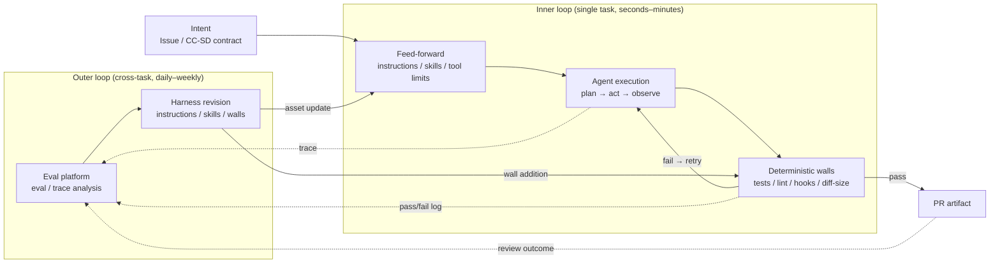
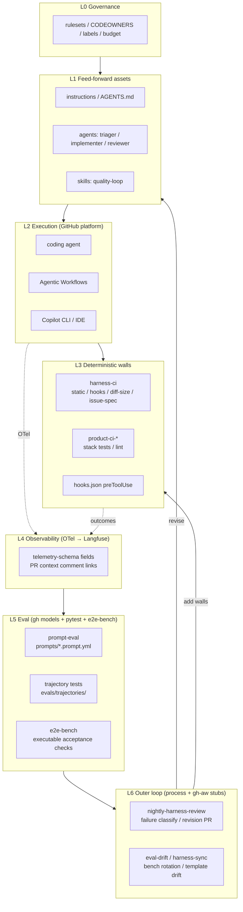

# Agent Harness Architecture — GitHub Copilot Core

**Version**: 1.1 (2026-07-04)  
**Repository**: `sdlc-gh` — template harness for GitHub Copilot coding agents  
**Canonical ops**: [operations.md](operations.md) (thresholds, retry policy, forbidden ops)

---

## 1. Executive summary

This document describes the architecture of **sdlc-gh**, a stack-agnostic agent harness template built on the GitHub Copilot ecosystem (coding agent, CLI/IDE, Agentic Workflows, GitHub Models) and complementary OSS (Langfuse, DeepEval, promptfoo, etc.).

A **harness** is the full mechanism for keeping AI agents aligned with intent — not just prompts. It combines:

- **Feed-forward**: instructions, agents, skills, tool limits, credential boundaries
- **Feedback**: deterministic walls (CI, hooks, diff-size gates), observability, evals, human PR review

Three design conclusions:

1. **Use off-the-shelf enforcement.** Isolation, safe outputs, deterministic walls, observability, and eval runners come from GitHub platform + OSS — do not rebuild them.
2. **Invest in intent definition.** Golden datasets, rubrics, wall content, and revision-cycle operations are the differentiation layer.
3. **Converge human judgment on PR review.** No matter how autonomous agents become, add gates at review time — not mid-execution approval prompts.

### Implementation status (this repo)

| Area | Status |
|------|--------|
| Bootstrap, stack catalog, harness/product CI | **Implemented** |
| Hooks, diff-size gate, CC-SD issue-spec check | **Implemented** |
| Custom agents (triager / implementer / reviewer) | **Implemented** |
| Eval CI with change-type job selection | **Implemented** |
| Retry orchestrator, PR context comments | **Implemented** |
| E2E bench (executable acceptance checks) | **Partial** — 9 tasks; not yet break-and-fix agent runner |
| `gh models eval` in CI | **Scaffolded** — runs when prompts exist; org must enable Models |
| gh-aw outer loop (`nightly-harness-review`, `weekly-redteam`) | **Stub** — Markdown + lock.yml placeholders; does not compile with `gh aw compile`; deferred epic |
| Langfuse / OTel export | **Scaffolded** — `infra/` + schema; inner-loop JSON artifacts wired |

Operational details and thresholds live in companion docs — see [Documentation index](#11-related-documentation).

---

## 2. Design principles

### 2.1 Harness as a control system

Model the harness as a dual-loop control system:



The **inner loop** runs fast (seconds–minutes). The **outer loop** runs slower (daily–weekly). Without the outer loop, the harness degrades as models and task distributions shift.

### 2.2 Five principles

**Principle 1: Walls are declarative and deterministic.** Constraints that depend on agent goodwill are not constraints. Prefer CI jobs, hooks, rulesets, and (when available) gh-aw safe outputs over prompt pleading.

**Principle 2: Structurally separate secrets from agents.** gh-aw's secretless design is the ideal; coding agent uses short-lived scoped tokens; CLI/IDE and SDK use delegated or proxied credentials. Never expose long-lived keys in agent-readable files.

**Principle 3: Log at every trust boundary.** Observability enables future control. Traces use OpenTelemetry; avoid vendor lock-in on the export path.

**Principle 4: No harness change without eval.** Changes to instructions, agents, skills, hooks, or eval assets must pass the change-type eval matrix before merge.

**Principle 5: One human gate — make it strong.** Collect decision inputs on the PR (scores, cost, trace links, harness asset SHAs). Do not scatter synchronous approval prompts.

> L2 auto-merge and L3 full auto-merge are **future promotions** with strict scope limits. PR review is never abolished — only its sync timing and scope change. See [operations.md](operations.md).

---

## 3. Platform and gap analysis

### 3.1 GitHub platform maturity (mid-2026)

| Layer | Offering | Maturity | Notes |
|-------|----------|----------|-------|
| Instruction hierarchy | `copilot-instructions.md`, `AGENTS.md`, `.instructions.md` | GA | Priority: custom agent > path-specific > global |
| Custom agents | `.github/agents/*.agent.md` | GA | Tools, handoffs, org distribution via `.github-private` |
| Skills | Agent Skills (open spec) | Available | On-demand load; compatible with Copilot / Claude Code / Codex |
| Hooks | `hooks.json` (6 events) | Available | Deterministic block of destructive ops |
| Environment setup | `copilot-setup-steps.yml` | Available | Agent continues even if setup fails — monitor it |
| Isolated execution | coding agent (Actions VM, own branch) | GA | Requester cannot approve own PR |
| Automation | Agentic Workflows (gh-aw) | Public Preview | Markdown → lock.yml, AWF firewall, safe outputs, threat detection |
| Observability | gh aw logs/audit, OTel export | Available | |
| Eval | GitHub Models: `.prompt.yml` + `gh models eval` | Available | Single-prompt eval; not full agent trajectory |
| Embedding | Copilot SDK | Public Preview | Node/Python/Go/.NET/Java |

### 3.2 OSS complement map

| Purpose | Primary | Alternative | Rationale |
|---------|---------|-------------|-----------|
| Trace / observability | Langfuse (self-host) | Phoenix, OpenLLMetry | OTel-compatible; de facto OSS choice |
| Trajectory / agent eval | DeepEval | promptfoo, Ragas | pytest-style CI integration; G-Eval |
| Red team | NVIDIA garak | AI-Infra-Guard | Periodic prompt-injection testing |
| Workflow static analysis | zizmor, actionlint | — | Integrated in `harness-ci` |
| Template assets | github/awesome-copilot | — | Official recipes |

### 3.3 Gaps requiring custom work

| Gap | Description | sdlc-gh response |
|-----|-------------|------------------|
| **G1** Trajectory golden dataset | `gh models eval` is prompt-level, not E2E Issue→PR | `evals/e2e-bench/` — executable acceptance checks today; break-and-fix runner planned |
| **G2** Rubrics | "Good PR" definition is domain-specific | `evals/trajectories/rubric.md` + convention tests |
| **G3** Revision-cycle operations | Trace → classify → revise routing | Documented in [failure-taxonomy.md](failure-taxonomy.md); gh-aw stubs for automation |

#### G1 runner boundary (current vs planned)

| Concern | Current (`run-e2e-bench.mjs`) | Planned break-and-fix runner |
|---------|-------------------------------|------------------------------|
| **Task input** | Static YAML fixture in `tasks/*.yml` | Issue + CC-SD contract + repo snapshot |
| **Expected artifact** | File content / command exit code | Agent-produced PR diff |
| **Verifier contract** | `verification_*` fields in task YAML | Same fields + agent execution harness |
| **Result summary** | Per-task ok/fail; class/stack counts; executed/skipped totals | Above + pass@1, retry count, wall failure class |

Manifest validation: `scripts/check-e2e-manifest.mjs`. Details: [evals/e2e-bench/README.md](../evals/e2e-bench/README.md).

---

## 4. UX design

### 4.1 Scope

| Category | Default | Examples |
|----------|---------|----------|
| In scope | L0–L2 candidates | App code, tests, refactors, dep bumps, docs |
| Always human | Production DB, prod secrets, billing/legal/PII | Never auto-delegate |
| L3 (conditional) | Typo/link/comment/docs only | Small, non-executable changes |

**v1 L1 enforcement** (CC-SD contract + `issue-spec-check`) applies only to `task:docs` and `task:test-fix`. See [coding-agent-l1.md](coding-agent-l1.md).

### 4.2 Personas

| Persona | Responsibility | Primary touchpoints |
|---------|----------------|---------------------|
| **Developer** | Write Issue, delegate to agent, review PR | Issue, PR, IDE, CLI |
| **Reviewer** | Final gate on PRs with bundled context | PR |
| **Harness engineer** | Maintain harness assets, run outer loop | `.github/**`, `evals/**`, morning queue |
| **Org admin** | MCP allowlist, model policy, budget | Organization settings |

### 4.3 UX principles

- **Single gate**: PR review only; hooks and CI replace mid-task approvals.
- **Bundled decision inputs**: PR context comment auto-posts diff stats, labels, retry count, instruction/skill SHAs, eval baseline, trace link placeholder.
- **Morning queue**: Outer-loop artifacts batched for daily review, not real-time interrupts.
- **Graduated autonomy**: L0→L3 with promotion evidence; see task-class matrix below.
- **Visible failures**: Retry exhaustion, security blocks, and drift warnings surface as structured PR comments and Issues.

### 4.4 Task classification and autonomy matrix

Enforced by Issue labels (`task:*`, `autonomy:*`) and `scripts/check-diff-size.mjs`:

| Task class | Examples | Max autonomy (default) | Size limits (LOC / files) |
|------------|----------|------------------------|---------------------------|
| `docs` | README, design docs | L3 | 60 / 2 |
| `test-fix` | Fix or add tests | L2 | 120 / 4 |
| `refactor` | Rename, dedupe | L1 | 300 / 8 |
| `feature-small` | Small feature | L1 | 300 / 8 |
| `dependency-bump` | patch/minor deps | L1 | 300 / 8 |
| `infra` | CI, IaC, deploy | L0 | Human gate |
| `security-sensitive` | Auth, billing, secrets | L0 | Proposal only |

L2/L3 labeled PRs **hard-fail** CI when limits exceeded. L1 **warns by default** (template). Phase 4 supports opt-in L1 hard-fail via `DIFF_SIZE_L1_HARD_FAIL=1`. `autonomy:L0` is proposal-only (no size gate).

### 4.5 CC-SD contract (L1 docs / test-fix)

Lightweight Issue-embedded spec — not a separate file:

| Field | Required |
|-------|----------|
| Goal | yes |
| Non-goals | yes |
| Constraints | yes |
| Acceptance criteria | yes |
| Rollback hints | yes |
| Additional context | optional |

Enforcement flow:

1. Author fills `.github/ISSUE_TEMPLATE/task.yml`
2. Triager validates contract and applies **labels** (form dropdown alone does not trigger CI)
3. `issue-spec-check` resolves the linked Issue (`closingIssuesReferences` first, then `fixes/closes #N` in the PR body), validates CC-SD when labels are `task:docs` or `task:test-fix` + `autonomy:L1`
4. Unlinked PRs warn and skip. Issue fetch failure **fails** only when PR or Issue proxy labels indicate L1 docs/test-fix; otherwise warn and skip
5. Reviewer checks Issue → PR summary → diff alignment

Canonical field names: `scripts/lib/ccsd-contract.mjs`.

---

## 5. Architecture overview

### 5.1 Layer model



### 5.2 Component map (as implemented in sdlc-gh)

| # | Component | Source | Implementation |
|---|-----------|--------|----------------|
| C1 | Instruction hierarchy | GitHub + custom | `.github/copilot-instructions.md`, `.github/instructions/` (core + stack profiles), `AGENTS.md` |
| C2 | Custom agents | GitHub + custom | `triager` (read), `implementer` (read/edit/search/execute), `reviewer` (read/search); handoffs triager→implementer |
| C3 | Skills | Open spec + custom | `.github/skills/quality-loop/SKILL.md` — verify against CC-SD before complete |
| C4 | Deterministic guards | GitHub + custom | `hooks/hooks.json` (force-push, rm -rf, DROP TABLE); `check-diff-size.mjs`; `check-open-pr-limit.mjs` (3 open PRs proxy for safe outputs) |
| C5 | Execution modes | GitHub | CLI/IDE, coding agent, gh-aw (stubs), SDK — see [auth-boundaries.md](auth-boundaries.md) |
| C6 | Walls (content) | Custom per repo | Stack `product-ci-*` workflows; sample apps under `sample/{stack}/` |
| C7 | Harness CI | Custom | `harness-ci.yml`: harness-static, issue-spec-check, open-pr-limit, diff-size, detect-projects → product-ci |
| C8 | Eval CI | Custom | `eval-ci.yml` + `select-eval-jobs.mjs` change-type matrix |
| C9 | Retry orchestrator | Custom | `agent-retry-orchestrator.yml` — max 3 retries, same-signature stop, security no-retry |
| C10 | PR context | Custom | `pr-context-comment.yml` — decision table on every PR |
| C11 | Bootstrap | Custom | `scripts/bootstrap-harness.sh` + `config/stacks.json` |
| C12 | Observability | OSS scaffold | `infra/langfuse/`, `infra/otel/`, [telemetry-schema.md](telemetry-schema.md) |

### 5.2.1 Eval matrix by change type

Implemented in `scripts/select-eval-jobs.mjs`:

| Changed paths | Eval jobs triggered |
|---------------|---------------------|
| `prompts/*.prompt.yml` | `prompt-eval` |
| `.github/agents/**` | `prompt-eval`, `agent-policy` |
| `.github/instructions/**`, `AGENTS.md` | `trajectory-conventions` |
| `.github/skills/**` | `trajectory-task` |
| `evals/**` | `meta-eval` |
| Default (other harness paths) | `trajectory-conventions` |

Weekly schedule runs full `e2e-bench` job regardless of PR paths.

### 5.2.2 Change size limits

Canonical values in [operations.md](operations.md). Enforced by `scripts/check-diff-size.mjs` from `autonomy:*` PR labels.

| Level | Max LOC | Max files | CI behavior |
|-------|---------|-----------|-------------|
| L0 | — | — | Proposal only |
| L1 | 300 | 8 | Warn (hard-fail opt-in via `DIFF_SIZE_L1_HARD_FAIL=1`) |
| L2 | 120 | 4 | Hard fail |
| L3 | 60 | 2 | Hard fail |

Over-limit changes should be split, not force-merged.

### 5.3 Task lifecycle (data flow)

```mermaid
sequenceDiagram
    participant Dev as Developer
    participant GH as GitHub Issue/PR
    participant TRI as triager agent
    participant IMP as implementer agent
    participant WALL as Walls (harness + product CI)
    participant RET as Retry orchestrator
    participant REV as Reviewer
    Dev->>GH: Issue with CC-SD contract
    GH->>TRI: Classify task:* / autonomy:*
    TRI->>GH: Labels applied (L1 requires complete contract)
    GH->>IMP: Delegate implementation
    loop Inner loop
        IMP->>IMP: Plan → edit → test
        IMP->>GH: Draft PR commits
        GH->>WALL: Required checks
        alt Check failure
            WALL->>RET: check_suite completed (failure)
            RET->>GH: Structured comment + retry:N label
            Note over RET: Max 3; same sig ×2 stops;<br/>security escalates immediately
        else Check pass
            WALL->>GH: PR context comment posted
            GH->>REV: Single human gate
            REV->>GH: Approve or request changes
        end
    end
```

**Failure classification** (outer-loop routing): feed-forward gap, wall gap, model limit — see [failure-taxonomy.md](failure-taxonomy.md). Retry comments include `wall_failure_type` and `failure_sig`.

### 5.4 Telemetry minimum schema

Required span fields defined in [telemetry-schema.md](telemetry-schema.md). Inner-loop workflows emit JSON artifacts per [telemetry-artifacts.md](telemetry-artifacts.md). PR context comment surfaces repo + PR number for Langfuse lookup when `LANGFUSE_HOST` is configured.

### 5.5 Reviewer checklist

From `reviewer.agent.md` and arch §5.5:

1. **Requirement fit** — Goal and Acceptance criteria met?
2. **Non-goal preservation** — Out-of-scope items untouched?
3. **Boundary compliance** — Constraints respected?
4. **Test adequacy** — Tests constrain the change?
5. **Accountability** — Eval scores, cost, trace links present?
6. **Rollback ease** — Rollback hints plausible?

Compare **Issue → PR summary → diff** in one pass.

### 5.6 Repository layout

**Template repo (`sdlc-gh`)**:

```text
sdlc-gh/
├── AGENTS.md                         # Project instructions (task classes, roles)
├── config/
│   └── stacks.json                   # Stack catalog (ts / python / go / ruby / php)
├── .github/
│   ├── copilot-instructions.md       # Global agent policy
│   ├── instructions/
│   │   ├── core.instructions.md
│   │   └── profiles/                 # Per-stack conventions
│   ├── agents/                       # triager / implementer / reviewer
│   ├── skills/quality-loop/SKILL.md
│   ├── hooks/hooks.json
│   ├── labels.yml                    # task:* / autonomy:* definitions
│   ├── CODEOWNERS
│   ├── ruleset.example.json
│   ├── ISSUE_TEMPLATE/task.yml       # CC-SD contract template
│   ├── pull_request_template.md
│   ├── aw/actions-lock.json
│   └── workflows/
│       ├── harness-ci.yml            # Walls + stack detection + product CI
│       ├── product-ci-{stack}.yml    # Per-stack test/lint (5 stacks)
│       ├── eval-ci.yml               # Change-type eval matrix
│       ├── eval-drift.yml            # Bench rotation + score drift Issues
│       ├── agent-retry-orchestrator.yml
│       ├── pr-context-comment.yml
│       ├── copilot-setup-steps.yml
│       ├── labels-sync.yml
│       ├── harness-sync.yml          # Weekly drift report
│       ├── nightly-harness-review.md # gh-aw stub (Phase 3)
│       ├── nightly-harness-review.lock.yml
│       ├── weekly-redteam.md         # gh-aw stub (Phase 3)
│       └── weekly-redteam.lock.yml
├── docs/                             # Architecture and operations
├── evals/
│   ├── trajectories/                 # pytest convention tests + rubric.md
│   ├── e2e-bench/                    # Task fixtures + manifest.json
│   └── .score-baseline.json
├── prompts/                          # .prompt.yml for gh models eval
├── scripts/                          # CI gate implementations, bootstrap
├── sample/                           # Minimal apps per stack (CI targets)
└── infra/                            # Langfuse + OTel collector scaffolding
```

**After bootstrap** (`scripts/bootstrap-harness.sh`):

- Only the selected stack's profile and `product-ci-*` workflow are copied
- `harness-ci.yml` is trimmed to a single product job
- Sample code expands to repo root when `--mode new`

In the template repo, marker detection runs all present stacks' product CI via `detect-projects` job.

Harness assets live in the product repo so Git history, PR review, and rollback apply directly. Org-wide shared assets can ship from a `.github-private` repository.

---

## 6. CI and automation reference

### 6.1 Harness CI jobs

| Job | Trigger | Purpose |
|-----|---------|---------|
| `harness-static` | PR, push main | `validate-harness.mjs`, actionlint, zizmor, hooks + issue-spec scenario tests |
| `issue-spec-check` | PR | CC-SD completeness for L1 docs/test-fix (`check-issue-spec.mjs`; uses `PR_LABELS` + linked Issue labels) |
| `open-pr-limit` | PR | Warn when author has >3 open PRs (`check-open-pr-limit.mjs`) |
| `diff-size` | PR | Autonomy size gate (`check-diff-size.mjs`) |
| `product-ci-*` | PR, push main | Stack tests/lint (conditional on marker files) |

### 6.2 Eval CI jobs

| Job | When | Purpose |
|-----|------|---------|
| `select` | PR / schedule | `select-eval-jobs.mjs` |
| `prompt-eval` | Selected | `gh models eval` on `prompts/*.prompt.yml` |
| `agent-policy` | Selected | Agent definition validation |
| `trajectory-conventions` | Selected | pytest harness convention tests |
| `trajectory-task` | Selected | Skill/task rubric tests |
| `meta-eval` | Selected | E2E manifest + bench runner + pytest |
| `e2e-bench` | Weekly schedule | Full bench run |

### 6.3 Local validation

```bash
npm run validate          # Harness asset consistency
npm run test-hooks        # Hook block/allow scenarios
npm run test-diff-size    # Diff-size scenarios
npm run test-e2e-manifest # E2E manifest scenarios
npm run test-doctor       # Doctor local check scenarios
npm run check-e2e         # E2E manifest checks
npm run verify-bootstrap  # Bootstrap integration (all stacks)
pytest evals/trajectories -q
```

Node 22 recommended for full E2E verifier parity with CI.

---

## 7. Phased rollout

Do not enable everything at once. Each phase uses prior metrics as promotion evidence.

| Phase | Timeline | Enable | sdlc-gh state |
|-------|----------|--------|---------------|
| **0** | ~2 weeks | CI walls, rulesets, optional Langfuse | harness-ci + product-ci |
| **1** | ~1 month | Instructions, agents, hooks, templates; record baseline KPIs | FF assets + labels sync |
| **2** | ~2 months | Eval CI + change-type matrix; E2E bench v1 | eval-ci, 9 e2e tasks |
| **3** | ~3 months | Retry orchestrator, PR context, gh-aw outer loop stubs | orchestrator + stubs (compile not guaranteed) |
| **4** | Stable ops | L2 promotion for docs; exception ledger; revert playbook | See [revert-playbook.md](revert-playbook.md), [exceptions/](exceptions/README.md) |

Detailed adoption steps: [adoption.md](adoption.md). L1 trial guide: [coding-agent-l1.md](coding-agent-l1.md).

---

## 8. Risks and mitigations

| Risk | Mitigation |
|------|------------|
| gh-aw Public Preview instability | Limit to outer loop; commit lock.yml; track release notes |
| Prompt injection | Input sanitization (gh-aw), secretless design, garak red-team stub; treat Issue body as untrusted |
| Auth boundary drift per mode | [auth-boundaries.md](auth-boundaries.md) matrix; no long-lived secrets in repo |
| Approval fatigue | Single PR gate; structured context comment; no mid-task prompts |
| Cost runaway | `max-ai-credits`; Langfuse cost fields; open-PR limit proxy |
| Eval overfitting | Quarterly 20% E2E rotation (`eval-drift.yml`); 15pt production gap threshold |
| Principle 4 hollowed out | Eval CI path filters + ruleset eval required |
| Retry loop runaway | Max 3 retries, same-signature stop, security immediate escalation |
| Oversized diffs | Autonomy size gates; split recommendation |
| Harness asset drift | `harness-sync.yml` weekly drift report; bootstrap re-run |

---

## 9. Custom investment areas

Quality ultimately depends on:

1. **Wall content** — test suites, contract tests, business-rule checks in product CI
2. **E2E bench (G1)** — expand from acceptance checks to break-and-fix agent runner; target 20–100 tasks
3. **Rubrics (G2)** — `evals/trajectories/rubric.md` and G-Eval / LLM-as-judge specs
4. **Revision cycle (G3)** — failure taxonomy routing; morning queue (~30 min/day)
5. **Feed-forward content** — domain rules in instructions / agents / skills
6. **Exception ledger** — [docs/exceptions/](exceptions/README.md)

---

## 10. KPIs

**Inner loop**: PR rejection rate, first-pass wall rate, AI credits per task, average retry count.

**Outer loop**: E2E pass rate trend, harness revision PR adoption rate, failure-class mix (wall-gap ratio declining = walls improving).

**Lagging quality**: 7-day revert rate, agent-caused hotfix rate, post-review fix rate.

**UX**: Review time per PR, morning queue processing time, autonomy level distribution.

Tracking template: [kpi-baseline.md](kpi-baseline.md).

---

## 11. Related documentation

| Document | Contents |
|----------|----------|
| [adoption.md](adoption.md) | Installation, bootstrap, rollback |
| [operations.md](operations.md) | **Canonical** thresholds, retry policy, forbidden ops |
| [coding-agent-l1.md](coding-agent-l1.md) | First L1 delegations (docs / test-fix) |
| [failure-taxonomy.md](failure-taxonomy.md) | Failure classification for outer loop |
| [telemetry-schema.md](telemetry-schema.md) | Required observability fields |
| [telemetry-artifacts.md](telemetry-artifacts.md) | Inner-loop JSON artifact format |
| [auth-boundaries.md](auth-boundaries.md) | Credential matrix per execution mode |
| [shared-config.md](shared-config.md) | Cross-repo harness distribution |
| [kpi-baseline.md](kpi-baseline.md) | Weekly KPI template |
| [exceptions/README.md](exceptions/README.md) | Policy exception records |
| [revert-playbook.md](revert-playbook.md) | Revert procedure |
| [infra/README.md](../infra/README.md) | Langfuse / OTel self-host |

---

## Appendix: Assumptions (July 2026)

- Agentic Workflows remain Public Preview with safe outputs, AWF firewall, and secretless defaults.
- Copilot SDK is Public Preview (MIT; JSON-RPC to CLI server).
- `gh models eval` supports `.prompt.yml` in CI (similarity, string match, LLM-as-judge).
- GitHub Copilot billing moved to AI credits (June 2026).
- Agent Skills are an open spec shared across Copilot, Claude Code, and Codex.
- Custom agents support tool restriction, handoffs, and org-level distribution.
